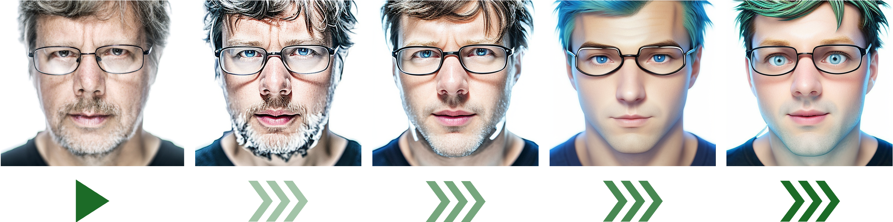

# Avatar Generator for Hyland CommunityLIVE 2024

This project provides a web application that generates avatars from headshots captured via webcam or uploaded files. It leverages the `img2img` functionality of the [Stable Diffusion](https://stability.ai) REST API, which is integrated through the [Stable Diffusion WebUI](https://github.com/AUTOMATIC1111/stable-diffusion-webui).

## Features

- **Avatar Creation**: Generate personalized avatars from headshots.
- **Flexible Input**: Accepts images from both webcam captures and file uploads.
- **Customizable**: Adjust the fantasy and gender preferences for the generated avatar.
- **Email Delivery**: Send the generated avatar directly to users via email.

## Requirements

- **Python**: Version 3.10
- **Stable Diffusion WebUI**: [GitHub Repository](https://github.com/AUTOMATIC1111/stable-diffusion-webui)
- **GPU**: Recommended for optimal performance
- **AWS CLI**: Required for utilizing AWS SES (Simple Email Service) to send avatars via email

## Samples



## Project Structure

The project is centered around a Python application (`app.py`) that exposes a REST API. This API processes an original image along with optional parameters (fantasy level and gender preference) and returns the generated avatar. The following directories and files are included:

```bash
.
├── app.py           # Main application file exposing REST API
├── static           # Static resources for the web application
│   ├── Hyland_logo.png
│   └── style.css
└── templates        # HTML templates
    └── index.html
```

## Setting Up Stable Diffusion WebUI

The Python application is configured to connect to the Stable Diffusion REST API at `http://localhost:7861/sdapi/v1/img2img` by default. Follow these steps to install and set up the REST API locally:

1. **Clone the Stable Diffusion WebUI Repository**

   ```bash
   git clone https://github.com/AUTOMATIC1111/stable-diffusion-webui
   cd stable-diffusion-webui
   ```

2. **Download a Stable Diffusion Model from Hugging Face**

   ```bash
   cd models/Stable-diffusion
   wget https://huggingface.co/lllyasviel/fav_models/resolve/main/fav/realisticVisionV51_v51VAE.safetensors
   cd ../..
   ```

3. **Create a Virtual Environment**

   ```bash
   python3 -m venv venv
   source venv/bin/activate
   ```

4. **Install Dependencies and Start the WebUI**

   Run the script to install requirements and start the application:

   ```bash
   ./webui.sh
   ```

   Once the application is running at `http://127.0.0.1:7860`, you can stop it with `Ctrl+C`.  
   _Note: This step is required only during the initial setup._

5. **Start the REST API**

   If you don't have a GPU, you can start the API using the CPU:

   ```bash
   python3 launch.py --nowebui --skip-python-version-check --always-cpu --skip-torch-cuda-test
   ```

   The API will be accessible via your browser at `http://localhost:7861/docs#/default/img2imgapi_sdapi_v1_img2img_post`.

## Local Testing

To test the application locally:

1. **Start the Stable Diffusion REST API** and ensure `http://localhost:7861/sdapi/v1/img2img` is reachable.

2. **Start the Web Application**

   Set up the Python environment and run the application:

   ```bash
   python3 -m venv venv
   source venv/bin/activate
   pip install flask requests Pillow boto3
   python3 app.py
   ```

3. **Access the Web Application**

   Open a web browser and navigate to `http://localhost:5000` to use the avatar generator.

## Deployment on AWS EC2

To deploy the application on an AWS EC2 instance, follow the usual process of setting up a server, ensuring that Python 3.10, the Stable Diffusion WebUI, and other dependencies are properly installed. Adjust security groups and instance types based on whether you are using a GPU. Refer to the [AWS documentation](https://docs.aws.amazon.com/ec2/index.html) for detailed instructions.


### Sample Deployment Guide for AWS EC2 with GPU

This guide outlines the steps to deploy the Avatar Generator application on an AWS EC2 instance equipped with a GPU.

#### **EC2 Instance Configuration**

- **Amazon Machine Image (AMI)**: Ubuntu 22.04
- **Instance Type**: `g4dn.xlarge`
- **Network Settings**: Open port 443 (for HTTPS)
- **Storage**: 60 GB

#### **1. Install NVIDIA Drivers**

**Update System Packages**

```bash
sudo apt-get update
sudo apt-get upgrade -y
```

**Verify NVIDIA Device Presence**

```bash
sudo lshw -c video
```

You should see output indicating the presence of an NVIDIA GPU, such as:

```
  *-display:1
       description: 3D controller
       product: TU104GL [Tesla T4]
       vendor: NVIDIA Corporation
```

**Install NVIDIA Drivers**

```bash
sudo apt install -y ubuntu-drivers-common
sudo ubuntu-drivers autoinstall
```

**Reboot the Instance**

```bash
sudo reboot
```

After rebooting, verify the NVIDIA drivers are correctly installed:

```bash
nvidia-smi
```

Expected output should show the NVIDIA driver version and CUDA version.

For additional details on installing NVIDIA drivers, refer to [Ubuntu's documentation](https://documentation.ubuntu.com/aws/en/latest/aws-how-to/instances/install-nvidia-drivers/).

#### **2. Install Stable Diffusion WebUI**

**Clone the Stable Diffusion WebUI Repository**

```bash
git clone https://github.com/AUTOMATIC1111/stable-diffusion-webui
cd stable-diffusion-webui
```

**Download Stable Diffusion Model**

```bash
cd models/Stable-diffusion
wget https://huggingface.co/lllyasviel/fav_models/resolve/main/fav/realisticVisionV51_v51VAE.safetensors
cd ../..
```

**Install Python Package Installer**

```bash
sudo apt install python3-pip
```

**Create and Activate a Virtual Environment**

```bash
python3 -m venv venv
source venv/bin/activate
```

**Install Dependencies and Start WebUI**

```bash
./webui.sh
```

You can stop the application with `Ctrl+C` after it starts running at `http://127.0.0.1:7860`.

**Start the REST API**

```bash
python3 launch.py --nowebui --skip-python-version-check --skip-torch-cuda-test
```

**Create a Startup Script for the REST API**

Create a script to easily start the API in the future:

```bash
$ cat start_api.sh
#!/bin/bash

# Navigate to the stable-diffusion-webui directory
cd stable-diffusion-webui

# Create a virtual environment if it doesn't exist
if [ ! -d "venv" ]; then
    python3 -m venv venv
fi

# Activate the virtual environment
source venv/bin/activate

# Launch the application and write output to api.log
python3 launch.py --nowebui --skip-python-version-check --skip-torch-cuda-test > ../api.log 2>&1 &

# Print a message indicating the application has started
echo "API has started. Output is being written to api.log"
```

#### **3. Install the Web Application**

**Clone the Web Application Repository**

```bash
git clone https://github.com/aborroy/communitylive-avatar.git
cd communitylive-avatar
```

**Create a Virtual Environment and Start the Application**

```bash
python3 -m venv venv
source venv/bin/activate
pip install flask requests Pillow boto3
python3 app.py
```

**Create a Startup Script for the Web Application**

Create a script to easily start the web application:

```bash
$ cat start_app.sh
#!/bin/bash

# Navigate to the app directory
cd communitylive-avatar

# Create a virtual environment if it doesn't exist
if [ ! -d "venv" ]; then
    python3 -m venv venv
fi

# Activate the virtual environment
source venv/bin/activate

# Launch the application and write output to app.log
python3 app.py > ../app.log 2>&1 &

# Print a message indicating the application has started
echo "Application has started. Output is being written to app.log"
```

#### **4. Configure HTTPS**

Since the application uses a webcam, a secure HTTPS connection is required. Use AWS Route 53 to route traffic to the EC2 instance. Example DNS: `communitylive-avatar.alfdemo.com`.

**Install NGINX**

```bash
sudo apt-get install nginx
```

**Install Certbot and NGINX Plugin**

```bash
sudo apt-get install certbot python3-certbot-nginx
```

**Configure NGINX**

Create an NGINX configuration file:

```bash
sudo vi /etc/nginx/sites-available/app
```

Add the following configuration:

```nginx
server {
    listen 80;
    server_name communitylive-avatar.alfdemo.com;

    client_max_body_size 64M;

    location / {
        proxy_pass http://127.0.0.1:5000;
        proxy_set_header Host $host;
        proxy_set_header X-Real-IP $remote_addr;
        proxy_set_header X-Forwarded-For $proxy_add_x_forwarded_for;
        proxy_set_header X-Forwarded-Proto $scheme;
    }
}
```

**Enable the NGINX Configuration**

```bash
sudo ln -s /etc/nginx/sites-available/app /etc/nginx/sites-enabled
```

**Test NGINX Configuration and Reload**

```bash
sudo nginx -t
sudo systemctl reload nginx
```

**Obtain an SSL Certificate**

```bash
sudo certbot --nginx -d communitylive-avatar.alfdemo.com
```

Certbot will automatically configure NGINX to use TLS on port 443.

#### **5. Install AWS CLI and configure AWS SES**

To enable email delivery of avatars using AWS SES (Simple Email Service), follow these steps:

1. **Install AWS CLI**:
   - Download and install the AWS Command Line Interface (CLI) by following the instructions on the [AWS CLI Installation Guide](https://docs.aws.amazon.com/cli/latest/userguide/install-cliv2.html).
   
2. **Configure AWS CLI**:
   - After installation, configure your AWS CLI by running the following command:
     ```bash
     aws configure
     ```
     - Enter your **AWS Access Key ID**, **Secret Access Key**, **Region**, and **Output format** when prompted.

3. **Set Up AWS SES**:
   - Verify your email address in the AWS SES Console or via the AWS CLI:
     ```bash
     aws ses verify-email-identity --email-address your_email@example.com
     ```
   - Once verified, you can send emails programmatically through the SES service.

4. **Test SES Email Sending**:
   - You can test sending an email using the following CLI command:
     ```bash
     aws ses send-email --from your_email@example.com --destination ToAddresses=recipient_email@example.com --message "Subject={Data=Test Email},Body={Text={Data=Hello!}}" 
     ```

With AWS SES configured, your application will be able to send the generated avatars via email to the specified recipients.

#### **6. Access the Application**

If all steps are completed successfully, your application will be accessible at [https://communitylive-avatar.alfdemo.com](https://communitylive-avatar.alfdemo.com).

